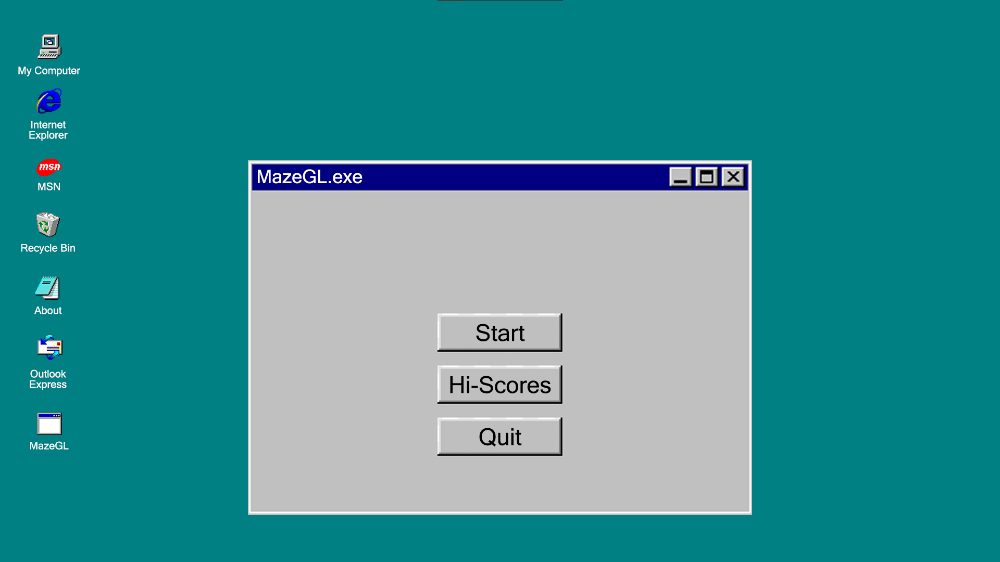
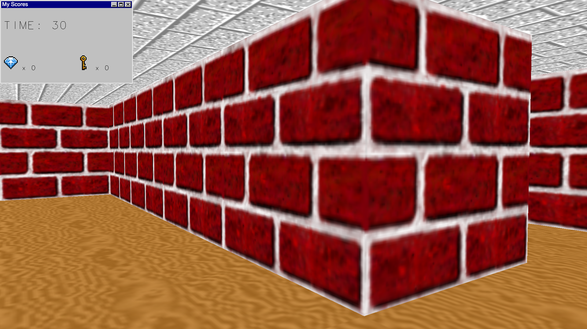
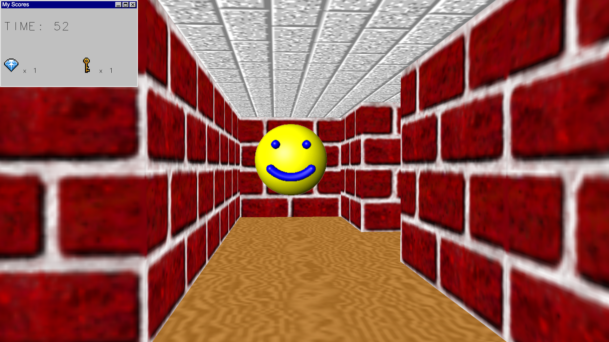

# MazeGL

It's a simple, nostalgic 3D maze exploration game developed with legacy OpenGL library. It's heavily inspired by Windows 95 3D maze screensaver.
The goal is to escape the maze as quickly as possible, while collecting the key (which is required to leave) and collecting gems to increase the score.

# Acknowledgments
[The sprites resource](https://www.spriters-resource.com/pc_computer/3dmazescreensaver/) for 3D windows 95 maze textures

[The texture resource](https://www.textures-resource.com/nintendo_64/mario64/texture/1194/) for Super Mario 64 textures
